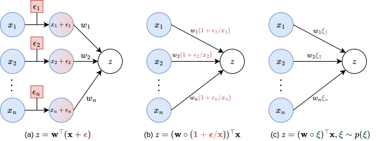
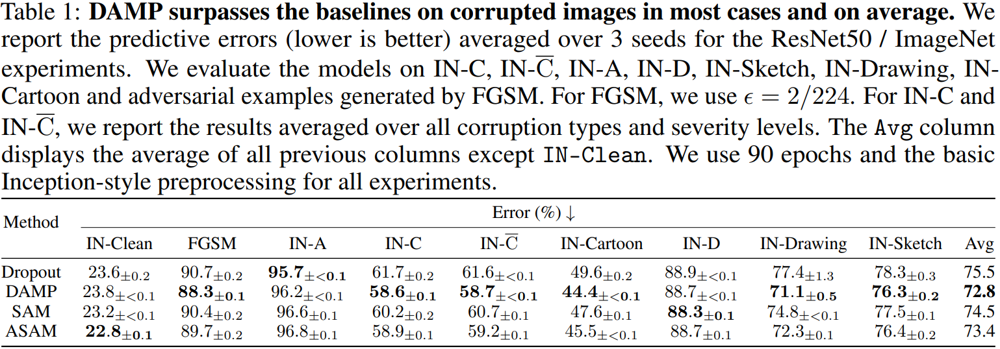
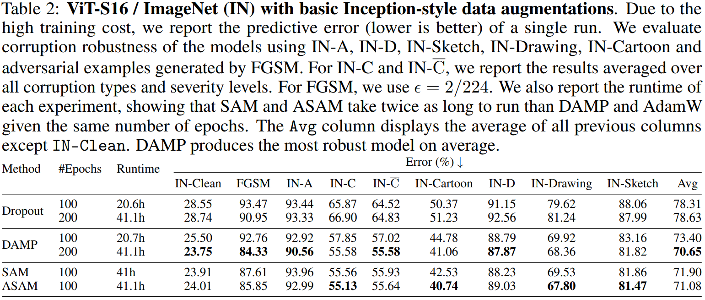
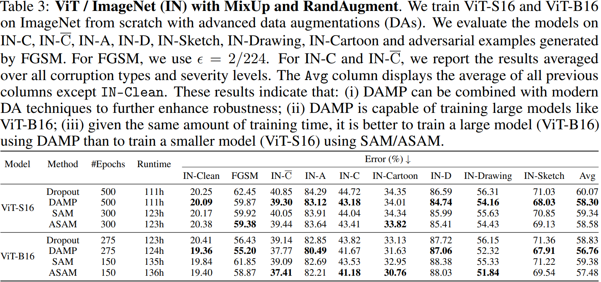

*This website contains information regarding the paper Improving robustness to corruptions with multiplicative weight perturbations.*

> **TL;DR**: We introduce Data Augmentation via Multiplicative Perturbation (DAMP), a training method that improves neural networks' robustness to corrupted inputs by multiplying each network weight with its own randomly sampled Gaussian noise during training. This simple approach matches or exceeds existing robustness methods while requiring less computational overhead.


Please cite our work if you find it useful:
```bibtex
@inproceedings{trinh2024improving,
    title={Improving robustness to corruptions with multiplicative weight perturbations},
    author={Trung Trinh and Markus Heinonen and Luigi Acerbi and Samuel Kaski},
    booktitle={The Thirty-eighth Annual Conference on Neural Information Processing Systems},
    year={2024},
    url={https://openreview.net/forum?id=M8dy0ZuSb1}
}
```
# Main takeaways

<div class="my_box" style="text-align: justify; text-justify: inter-word;">
<ol style="padding-right:30px">
<li>The effects of input corruptions can be simulated during training via multiplicative weight perturbations</li>
<li>From this insight, we propose a new training algorithm called DAMP which perturbs weights using multiplicative Gaussian random variables during training while having the same training cost as standard SGD.</li>
<li>We demonstrate that DAMP consistently improves generalization ability of DNNs under corruptions across different image classification datasets and model architectures.</li>
<li>Notably, we demonstrate that DAMP can train a ViT from scratch on ImageNet, achieving similar accuracy to a ResNet50 in 200 epochs with only basic Inception-style preprocessing. This is significant as ViT typically requires advanced training methods or sophisticated data augmentation to match ResNet50’s performance when being trained on ImageNet from scratch. We also show that DAMP can be combined with modern augmentation techniques such as MixUp and RandAugment to further improve robustness of neural networks.</li>
<li style="font-weight:bold;">DAMP is most effective when applied to training of large models on large datasets.</li>
</ol>
</div>

# High-level intuition



The figure above depicts a pre-activation neuron\\(z=\mathbf{w}^\top\mathbf{x}\\)in the presence of (a) covariate shift\\(\color[RGB]{184,84,80}\boldsymbol{\epsilon}\\), (b) a multiplicative weight perturbation (MWP) equivalent to\\(\color[RGB]{184,84,80}\boldsymbol{\epsilon}\\), and (c) random MWPs\\(\color[RGB]{74,122,114}\boldsymbol{\xi}\\).\\(\circ\\) denotes the Hadamard product. Figs. (a) and (b) show that for a covariate shift\\(\color[RGB]{184,84,80}\boldsymbol{\epsilon}\\), one can always find an equivalent MWP. From this intuition, we propose to inject random MWPs\\(\color[RGB]{74,122,114}\boldsymbol{\xi}\\)to the forward pass during training as shown in Fig. (c) to robustify a DNN to covariate shift.

# Theorem
Given a dataset\\(\mathcal{S}=\\{(\mathbf{x}\_i,y\_i)\\}\_{i=1}^N\subset\mathcal{X}\times\mathcal{Y}\\), a corruption\\(\mathbf{g}:\mathcal{X}\rightarrow\mathcal{X}\\), neural network weights\\(\boldsymbol{\omega}\in\mathcal{W}\\), and a loss function\\(\mathcal{L}\\). Under some weak assumptions about\\(\mathbf{g}\\)and\\(\mathcal{L}\\), there exists an MWP\\(\boldsymbol{\xi}\_{\mathbf{g}}\in\mathcal{W}\\)and a constant\\(C\_{\mathbf{g}}>0\\)such that:
\begin{equation}
\underbrace{\mathcal{L}(\boldsymbol{\omega};\mathbf{g}(\mathcal{S}))}\_{\text{Loss under corruption}}\leq\underbrace{\mathcal{L}(\boldsymbol{\omega}\circ\boldsymbol{\xi}\_{\mathbf{g}};\mathcal{S})}\_{\text{Loss under perturbations}}+\underbrace{\frac{C\_{\mathbf{g}}}{2}||\boldsymbol{\omega}||\_F^2}\_{L_2\text{ regularization}}
\end{equation}
where\\(\mathbf{g}(\mathcal{S})=\\{(\mathbf{g}(\mathbf{x}\_i),y\_i)\\}\_{i=1}^N\\).

## Implications
The MWPs simulate input corruptions during training, making the model robust to these simulated corruptions, which then improve robustness to real-world corruptions.

# Proposed method: Data Augmentation via Multiplicative Perturbations (DAMP)
DAMP ins an efficient training method that perturbs weights using multiplicative Gaussian random variable during training by minimizing the following loss function:
\begin{equation}
\mathcal{L}\_{\text{DAMP}}(\boldsymbol{\omega};\mathcal{S}) := \underbrace{\mathbb{E}\_{\boldsymbol{\xi}\sim\mathcal{N}(\boldsymbol{1},\sigma^2\mathbf{I})}\left[\mathcal{L}(\boldsymbol{\omega}\circ\boldsymbol{\xi};\mathcal{S})\right]}_{\text{expected loss under perturbations}} + \underbrace{\frac{\lambda}{2}||\boldsymbol{\omega}||_F^2}\_{L_2\text{ regularization}}
\end{equation}
To efficiently estimate the expectation, DAMP splits the training batch evenly into\\(M\\)sub-batches, then samples a weight perturbation for each sub-batch to calculate the sub-batch gradient, and finally averages over all sub-batch gradients to obtain the final gradient. Therefore, DAMP is suitable for data parallelism in multi-GPU training.

# Experiment results on ImageNet
We perform experiments with ResNet50 [1] and ViT [2] architectures on ImageNet [3], and we choose Dropout [4], SAM [5], and ASAM [6] as baselines. For corrupted versions of ImageNet, we use ImageNet-C [7], ImageNet-\\(\bar{C}\\) [8], ImageNet-D [9], ImageNet-A [10], ImageNet-Sketch [11], ImageNet-Drawing and ImageNet-Cartoon [12], and FGSM [13] for adversarial corruptions.





**ResNet50 / ImageNet** Table 1 presents the predictive errors for the ResNet50 / ImageNet setting on a variety of corruption test sets. It shows that DAMP consistently outperforms the baselines in most corruption scenarios and on average, despite having half the training cost of SAM and ASAM.




**ViT-S16 / ImageNet / Basic augmentations** Table 2 presents the predictive errors for the ViT-S16 / ImageNet setting, using the training setup from [14] but with only basic Inception-style preprocessing [15]. Remarkably, DAMP can train ViT-S16 from scratch in 200 epochs to match ResNet50’s accuracy without advanced data augmentation. This is significant as ViT typically requires either extensive pretraining [2], comprehensive data augmentation [14], sophisticated training techniques [16], or modifications to the original architecture [17] to perform well on ImageNet. Additionally, DAMP consistently ranks in the top 2 for corruption robustness across various test settings and has the best corruption robustness on average (last column). Comparing Tables 1 and 2 reveals that ViT-S16 is more robust to corruptions than ResNet50 when both have similar performance on clean images.




**ViT / ImageNet / Advanced augmentations** Table 3 presents the predictive errors of ViT-S16 and ViT-B16 on ImageNet with MixUp [18] and RandAugment [19]. These results indicate that DAMP can be combined with modern augmentation techniques to further improve robustness. Furthermore, using DAMP to train a larger model (ViT-B16) yields better results than using SAM/ASAM to train a smaller model (ViT-S16), given the same amount of training time.

## References
<p style="font-size: small;">
[1] Kaiming He, Xiangyu Zhang, Shaoqing Ren, and Jian Sun. Deep residual learning for image recognition. In IEEE conference on Computer Vision and Pattern Recognition, 2016a.
</p>
<p style="font-size: small;">
[2] Alexey Dosovitskiy, Lucas Beyer, Alexander Kolesnikov, Dirk Weissenborn, Xiaohua Zhai, Thomas Unterthiner, Mostafa Dehghani, Matthias Minderer, Georg Heigold, Sylvain Gelly, Jakob Uszkoreit, and Neil Houlsby. An image is worth 16x16 words: Transformers for image recognition at scale. In International Conference on Learning Representations, 2021. URL https://openreview.net/forum?id=YicbFdNTTy
</p>
<p style="font-size: small;">
[3] Jia Deng, Wei Dong, Richard Socher, Li-Jia Li, Kai Li, and Li Fei-Fei. Imagenet: A large-scale hierarchical image database. In IEEE Conference on Computer Vision and Pattern Recognition, pages 248–255, 2009. doi: 10.1109/CVPR.2009.5206848.
</p>
<p style="font-size: small;">
[4] Nitish Srivastava, Geoffrey Hinton, Alex Krizhevsky, Ilya Sutskever, and Ruslan Salakhutdinov. Dropout: A simple way to prevent neural networks from overfitting. Journal of Machine Learning Research, 15(56):1929–1958, 2014. URL http://jmlr.org/papers/v15/srivastava14a.
html.
</p>
<p style="font-size: small;">
[5] Pierre Foret, Ariel Kleiner, Hossein Mobahi, and Behnam Neyshabur. Sharpness-aware minimization for efficiently improving generalization. In International Conference on Learning Representations, 2021. URL https://openreview.net/forum?id=6Tm1mposlrM.
</p>
<p style="font-size: small;">
[6] Jungmin Kwon, Jeongseop Kim, Hyunseo Park, and In Kwon Choi. Asam: Adaptive sharpness-aware minimization for scale-invariant learning of deep neural networks. In International Conference on Machine Learning, pages 5905–5914. PMLR, 2021.
</p>
<p style="font-size: small;">
[7] Dan Hendrycks and Thomas Dietterich. Benchmarking neural network robustness to common corruptions and perturbations. arXiv preprint arXiv:1903.12261, 2019.
</p>
<p style="font-size: small;">
[8] Eric Mintun, Alexander Kirillov, and Saining Xie. On interaction between augmentations and corruptions in natural corruption robustness. In A. Beygelzimer, Y. Dauphin, P. Liang, and J. Wortman Vaughan, editors, Advances in Neural Information Processing Systems, 2021. URL https://openreview.net/forum?id=LOHyqjfyra.
</p>
<p style="font-size: small;">
[9] Chenshuang Zhang, Fei Pan, Junmo Kim, In So Kweon, and Chengzhi Mao. Imagenet-d: Benchmarking neural network robustness on diffusion synthetic object. In Proceedings of the IEEE/CVF Conference on Computer Vision and Pattern Recognition (CVPR), pages 21752–21762, June 2024.
</p>
<p style="font-size: small;">
[10] Dan Hendrycks, Kevin Zhao, Steven Basart, Jacob Steinhardt, and Dawn Song. Natural adversarial examples. In Proceedings of the IEEE/CVF Conference on Computer Vision and Pattern Recognition (CVPR), pages 15262–15271, June 2021.
</p>
<p style="font-size: small;">
[11] Haohan Wang, Songwei Ge, Zachary Lipton, and Eric P Xing. Learning robust global representations by penalizing local predictive power. In H. Wallach, H. Larochelle, A. Beygelzimer, F. d'Alché-Buc, E. Fox, and R. Garnett, editors, Advances in Neural Information Processing Systems, volume 32. Curran Associates, Inc., 2019. URL https://proceedings.neurips.cc/paper_files/paper/2019/file/3eefceb8087e964f89c2d59e8a249915-Paper.pdf.
</p>
<p style="font-size: small;">
[12] Tiago Salvador and Adam M Oberman. Imagenet-cartoon and imagenet-drawing: two domain shift datasets for imagenet. In ICML 2022 Shift Happens Workshop, 2022. URL https://openreview.net/forum?id=YlAUXhjwaQt.
</p>
<p style="font-size: small;">
[13] Ian J Goodfellow, Jonathon Shlens, and Christian Szegedy. Explaining and harnessing adversarial examples. arXiv preprint arXiv:1412.6572, 2014.
</p>
<p style="font-size: small;">
[14] Lucas Beyer, Xiaohua Zhai, and Alexander Kolesnikov. Better plain vit baselines for imagenet-1k. arXiv preprint arXiv:2205.01580, 2022.
</p>
<p style="font-size: small;">
[15] Christian Szegedy, Vincent Vanhoucke, Sergey Ioffe, Jon Shlens, and Zbigniew Wojna. Rethinking the inception architecture for computer vision. In Proceedings of the IEEE conference on computer vision and pattern recognition, pages 2818–2826, 2016.
</p>
<p style="font-size: small;">
[16] Xiangning Chen, Cho-Jui Hsieh, and Boqing Gong. When vision transformers outperform resnets without pre-training or strong data augmentations. In International Conference on Learning Representations, 2022. URL https://openreview.net/forum?id=LtKcMgGOeLt.
</p>
<p style="font-size: small;">
[17] Li Yuan, Yunpeng Chen, Tao Wang, Weihao Yu, Yujun Shi, Zi-Hang Jiang, Francis EH Tay, Jiashi Feng, and Shuicheng Yan. Tokens-to-token vit: Training vision transformers from scratch on imagenet. In Proceedings of the IEEE/CVF international conference on computer vision, pages 558–567, 2021.
</p>
<p style="font-size: small;">
[18] Hongyi Zhang, Moustapha Cisse, Yann N. Dauphin, and David Lopez-Paz. mixup: Beyond empirical risk minimization. International Conference on Learning Representations, 2018. URL https://openreview.net/forum?id=r1Ddp1-Rb.
</p>
<p style="font-size: small;">
[19] Ekin D Cubuk, Barret Zoph, Jonathon Shlens, and Quoc V Le. Randaugment: Practical automated data augmentation with a reduced search space. In Proceedings of the IEEE/CVF conference on computer vision and pattern recognition workshops, pages 702–703, 2020.
</p>